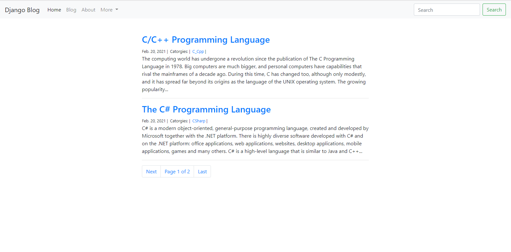
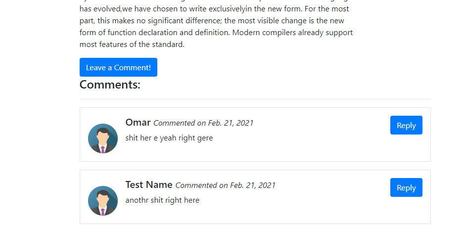
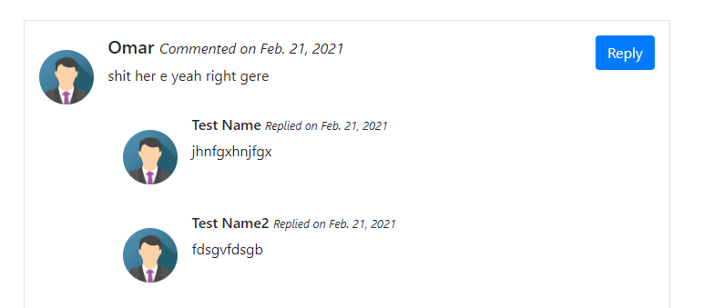
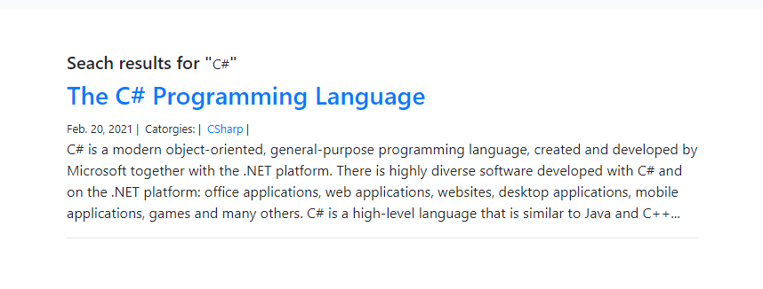

### Django Blog
A simple blog with Django framework and boostrap 4, (I created this last year)
## Features: 
- Posts
- Comments (Anon, no user support)
- Replies to Comments (Anon, no user support)
- Search & Categories
## Screenshots: 

